# Project 2: Design Journey

**For each milestone, complete only the sections that are labeled with that milestone.** Refine all sections before the final submission.

You are graded on your design process. If you later need to update your plan, **do not delete the original plan, leave it in place and append your new plan _below_ the original.** Then explain why you are changing your plan. Any time you update your plan, you're documenting your design process!

**Replace ALL _TODOs_ with your work.** (There should be no TODOs in the final submission.)

Be clear and concise in your writing. Bullets points are encouraged.

**Everything, including images, must be visible in _Markdown: Open Preview_.** If it's not visible in the Markdown preview, then we can't grade it. We also can't give you partial credit either. **Please make sure your design journey should is easy to read for the grader;** in Markdown preview the question _and_ answer should have a blank line between them.

## Understanding Users (Milestone 1)

**Make the case for your decisions using concepts from class, as well as other design principles, theories, examples, and cases from outside of class.**

You can use bullet points and lists, or full paragraphs, or a combo, whichever is appropriate. The writing should be solid draft quality but doesn't have to be fancy.

### User Interview Questions (Milestone 1)
> Plan the user interview which you'll use to identify the goals of your site's audience.
> You may use the interview template below and revise it as much as you desire.
> You are **required to author 3 of your own questions**.

**User Interview Briefing & Consent:** Hi, I am a student at Cornell University. I'm currently taking a class on web design and for a project, I am re-designing the website for Ithaca's Apple Harvest Festival. I'm trying to learn more about the people that might use this site. May I ask you a few questions? It will take about 10 minutes. You are free to quit at any time.

(These questions assume you are interviewing a festival attendee at the festival. If you didn't attend the festival, you may revise the questions and instead ask the participant to recall the last festival/event they attended. Do not ask them to speculate about visiting the Apple Harvest Festival. User speculation provides biased data.)

1. Please tell me a bit about yourself. You may omit any personal or private information.

2. What is the last festival or event you have been to?

3. Before attending that festival or event, did you seek out any information about it before going there?
3a. If yes, What information were you specifically looking for? Did you find it? How did you access that information?

4. When you arrived at the festival or event, did you seek out any information about it?
4a. If yes, What was that information? How did you obtain it?

5. While you were participating in the festival or event, have you sought out information about it?
5a. If yes, What was that information? How did you obtain it?

6. What is one thing about the festival or event that you would want to find more about?

7. Have you ever visited a site specific to a festival or event?
7a. If yes, what part of the site did you spend most of your time on?

8. What haven't I asked you today that you think would be valuable for me to know?

**After the interview:** This was really helpful. Thank you so much for agreeing to speak with me today. Have a great day!

### Interview Notes (Milestone 1)
> Interview at least 3 people from your audience. Take notes and include those notes here. Make sure to include a brief description of each interviewee.
> **Copy the interview questions above into each interviewee section below.**
> Take notes for each participant inline with the questions.

**Interviewee 1:**

1. Please tell me a bit about yourself. You may omit any personal or private information.

> He is a sophmore at Cornell in ILR.

2. What is the last festival or event you have been to?

> He attended the Ithaca Apple Harvest Festival last semester.

3. Before attending that festival or event, did you seek out any information about it before going there?
3a. If yes, What information were you specifically looking for? Did you find it? How did you access that information?

> He did seek out some information before going there. He wanted to look at the specific location it was located in and the duration of the festival. He did find it on the site's main page. It said downtown Ithaca and provided a map to help find it. He also said that there was a section of the time of the festival that he used.

4. When you arrived at the festival or event, did you seek out any information about it?
4a. If yes, What was that information? How did you obtain it?

> He looked for a map of the different stalls and secitons and he obstained it through the website. He said it was at the beginning of the main page so it was easy to find just by scrolling.

5. While you were participating in the festival or event, have you sought out information about it?
5a. If yes, What was that information? How did you obtain it?

> He went back to the time section to see what events are coming up. He obstained it on the main page by scrolling to the time section.

6. What is one thing about the festival or event that you would want to find more about?

> He wants to know more about how some of the products are made. He pointed out the apple cider.

7. Have you ever visited a website of a festival or event?
7a. If yes, what part of the site did you spend most of your time on?

> He spends most of his time on the map and the time secitons.

8. What haven't I asked you today that you think would be valuable for me to know?

> He thought that the site was pretty unorganized.

**Interviewee 2:**

1. Please tell me a bit about yourself. You may omit any personal or private information.

> She is a local resident of Ithaca. She has been here for years.

2. What is the last festival or event you have been to?

> She attended the Ice and Lights Festival in Ithaca in December.

3. Before attending that festival or event, did you seek out any information about it before going there?
3a. If yes, What information were you specifically looking for? Did you find it? How did you access that information?

> She seeked out some information before going there. She wanted to look at the event timeline. She accessed it on the website meant for this festival. The timeline was there.

4. When you arrived at the festival or event, did you seek out any information about it?
4a. If yes, What was that information? How did you obtain it?

> She didn't seek out information. She walked around the area.

5. While you were participating in the festival or event, have you sought out information about it?
5a. If yes, What was that information? How did you obtain it?

> She didn't seek out information. She spent most of her time visitng the different parts and events.

6. What is one thing about the festival or event that you would want to find more about?

> She wanted to know more about the layout of the festival, if there was a prepared one already.

7. Have you ever visited a website of a festival or event?
7a. If yes, what part of the site did you spend most of your time on?

> She spent most of her time on the timeline section along with looking through the photos of the event on the site.

8. What haven't I asked you today that you think would be valuable for me to know?

> The festival was really pretty according to her. She believes that it could help to show others in Ithaca what it looked like.

**Interviewee 3:**

1. Please tell me a bit about yourself. You may omit any personal or private information.

> He is a local resident in Ithaca. He is an Uber driver.

2. What is the last festival or event you have been to?

> He did attend the Apple Harvest Festival in Ithaca last year.

3. Before attending that festival or event, did you seek out any information about it before going there?
3a. If yes, What information were you specifically looking for? Did you find it? How did you access that information?

> He did seek out some information before going there. He wanted to know where he could put his vehicle. He also wanted to know what the layout of the festival looked like. He found both of these things at the site's main page. There was a map and a travel section on site.

4. When you arrived at the festival or event, did you seek out any information about it?
4a. If yes, What was that information? How did you obtain it?

> He didn't visit the site and wasn't looking for any info. He has been to the festival in the past so he didn't have any questions when he arrived there.

5. While you were participating in the festival or event, have you sought out information about it?
5a. If yes, What was that information? How did you obtain it?

> He wanted to time-specific events there were during the festival. He didn't want to miss them. He found out about the timeline on the site. It has a section for the timeline on the site.

6. What is one thing about the festival or event that you would want to find more about?

> He wanted to know more about its past in Ithaca and how it was recieved in Ithaca in the past.

7. Have you ever visited a website of a festival or event?
7a. If yes, what part of the site did you spend most of your time on?

> He spent most of his time on the travel section and the timeline section.

8. What haven't I asked you today that you think would be valuable for me to know?

> He wants to see more photos of the festival.

### Goals (Milestone 1)
> Analyze your audience's goals from your notes above.
> List each goal below. There is no specific number of goals required for this, but you need enough to do the job (Hint: It's more than 1 and probably more than 2).

Goal 1: Add more photos to the site

- **Design Ideas and Choices** _How will you meet those goals in your design?_
  - I will sprinkle in photos to each section to make it easier to absorb the content and see what to expect. The photos will be related to the section and the content it is refrencing.
- **Rationale & Additional Notes** _Justify your decisions; additional notes._
  - This is important because it will help the audience who visit the site absorb the content better and get an idea of what to expect.

Goal 2: Organize the content into multiple pages.

- **Design Ideas and Choices** _How will you meet those goals in your design?_
  - I will create new files/pages that will contain specific content that is different from the other pages.
- **Rationale & Additional Notes** _Justify your decisions; additional notes._
  - This is important because all the content on the current website is all cramped up together and it is hard to navigate the site. It will be good to split it up so that people can navigate to their desired content faster without having to go through other pieces of content.

Goal 3: Make the content more appealing and organized

- **Design Ideas and Choices** _How will you meet those goals in your design?_
  - I will more flex tables and more css elements (like color, sizes, margins, centering, etc.) to it so they are easier to see, understand, and absorb their contents.
- **Rationale & Additional Notes** _Justify your decisions; additional notes._
  - This is important because the current content is unorganized and hard to browse through and absorb information. It is important to keep the site organized and appealing as it will let users to see the content and see what parts are important. It will also help users distinguish the different parts of the content if it uses more of these elements.

### Audience (Milestone 1)
> Briefly explain your site's audience.
> Be specific and justify why this audience is a **cohesive** group with regard to the Ithaca Apple Harvest Festival. .

The site's audience is made up of a combination of students, Ithaca locals, and enthusiasts of apple and cider and all things related.This group is a cohesive group because all members of this group want to know something more about a common thing, which is the Ithaca Apple harvest Fesitval. They will consist the majority of the participants of the festival as it is located in Ithaca, which is a place filled with students and local residents. This festival might also attract apple and cider enthusiasts so they might also visit the site to learn more about this event.

## Festival/Event Website Design Exploration (Milestone 1)

Identify three festival or event websites (preferably static websites) that exist today on the web. You will be drawing inspiration from these sites for your own site; please select websites that are similar to the website you wish to create.

Include two screenshots of the home page for each site: narrow and wide.

**We'll refer to these are your "example websites."**

1. <https://lionssharedigital.com/portfolio/summer-meltdown-festival-2017/>

    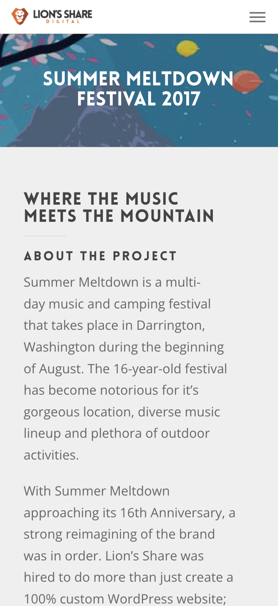

    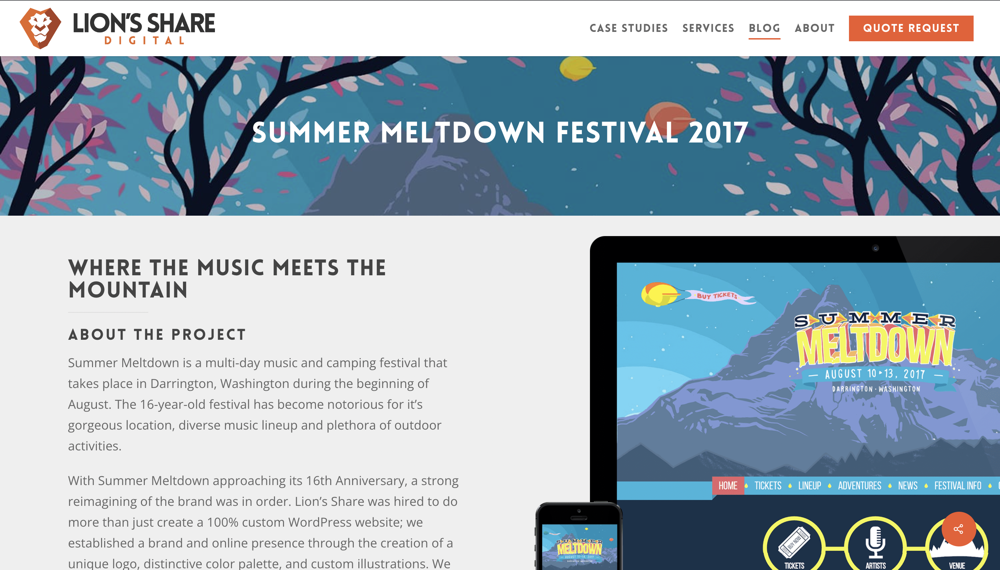

2. <https://newportfolk.org/>

    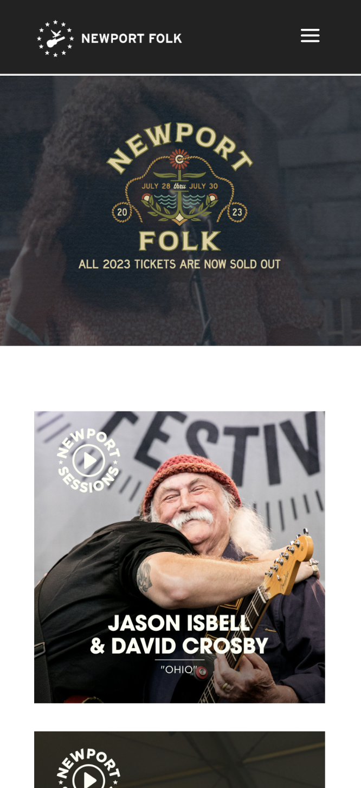

    

3. <https://www.reactor.school/>

    

    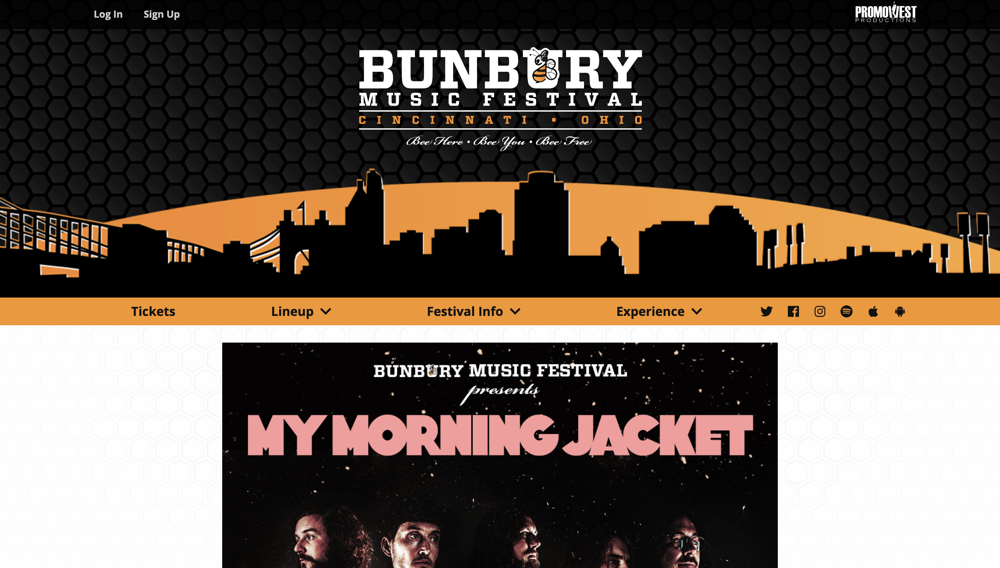

### Festival/Event Website 1 Review (Milestone 1)
> Review the website you identified above. (1 paragraph)
> In your review, include a discussion common design patterns in the site.

The Wide Page has a banner on the top that draws attention and lets the audience know its for the Summer Meltdown Festival 2017. The top left is a logo of the company/event and the top right is a nav bar. There is a consistent color theme of white, blue, and organe. The narrow page has a similar layour except that the nav bar is condenced into a toggle menu button on the top right to save space. There is content with appropriate headers below the banner and is next to an image on the right that would enhance the content. The narrow page doesn't have this and has just the content as it will be easier to see this on a narrow display.

### Festival/Event Website 2 Review (Milestone 1)
> Review the website you identified above. (1 paragraph)
> In your review, include a discussion common design patterns in the site.

The top left of the page is a logo of the group and the top right is a nav bar containing important event content that users would want to use. There is a consistent color theme of black and white. There is also a big banner right below the nav bar and logo section. This banner also has the main logo right in the center. The narrow page has a similar layour except that the nav bar is condenced into a toggle menu button on the top right to save space. There is conetent in a 3 column flex grid layout below the banner and flex boxes contains images. The narrow page makes is only a 1 column box section as it will be easier to see this on a narrow display.

### Festival/Event Website 3 Review (Milestone 1)
> Review the website you identified above. (1 paragraph)
> In your review, include a discussion common design patterns in the site.

The top right of the page is a logo of the organizers and the top left is a sign-up/log-in section. It is followed by a big banner that contains the festival logo along with a graphic outline of the city. Below the banner is the nav bar containing important event content that users would want to use. There is a consistent color theme of black, orange, and white. Below the nav bar is the most important content containing the upcoming festival and the date and location in an graphic layout. The narrow page has a similar layour except that the nav bar is condenced into a toggle menu button on the top right to save space. The space with the menu button also has a button for buying tickets on the left since it is a popular sections users would visit. The image is readjusted to fit the narrow display and its margins aligns with that of the text box below it.

## Content Planning (Milestone 1)

Plan your site's content.

### Your Site's Planned Content (Milestone 1)
> List **all** the content you plan to include your website.
> You should list all types of content you planned to include (i.e. text, photos, images, etc.)

- Image Gallery of the festival
- Directions
- Image of Directions
- Parking Details
- Timeline
- Surrounding things
- Images of the Surrounding things
- Different types of Stalls
- images of the stalls
- History of the Festival
- Images of the festival in the past
- Images of the products
- Images of the festival
- Features Stalls
- Short description of the festival
- Longer description of the festival

### Content Justification (Milestone 1)
> Explain (about a paragraph) why this content is the right content for your site's audience and how the content addresses their goals.

This content is the right content for my site's audience becuase it addresses everything a potential visitor, the target audience, would want and need to know about the fesitval. I added content about how to get there, what to expect, what the area is like, the history of the event, and what it would look like. The target audience would definetly want to know about when and where it is. They would also want to know how to get there and what it looks like. They also want to know about the stalls, a major portion of the festival.

## Information Architecture (Milestone 1)

### Content Organization (Milestone 1)
> Document your **iterations** of card sorting here. You must have at least 2 iterations of card sorting.
> Include photographic evidence of each iteration of card sorting **and** description of your thought process for each iteration.
> Please physically sort cards; please don't try and do this digitally.

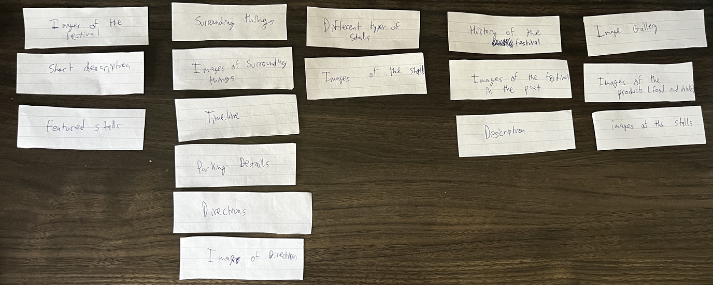

This iteration splits the planned content into 5 groups. One that holds small snipets of other contents like stalls and descriptions. This is good for a home page so that users can take in some important content that is made short. There is a also a group for everything a user who is visiting the event would want to know, which is parking, how to get there, and the surrounding stores/activities. There is a group for the different types of stalls that will be at the festival along with their images as potential users would want to know what to expect and there are a lot of stalls so this should be its own section. There is also a group that covers the hisstory and full description of the festival. This section is for people who wants to learn more about the festival, and is not every user would visit this page so its content should be in this seperate group. There is one last group that is an image gallery of the different aspects of the festival. This would also help people know what to expect from attenting the festival and there are a lot of images that cover the festival as a whole so it should be in its own section.

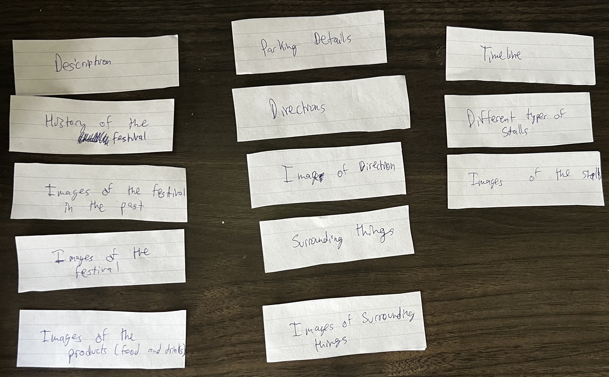

This iteration splits the planned content into 3 groups. One group combines the description, history, and images. This is good for a home page as it contains information about the festival itself. The more specific content is split between the two other groups. There is a group about content for when and how to get there, like parking details, directions, surrounding attractions/things, and the images associated to this content group. I also grouped the timeline, the stalls, and their images as a group. I did this because people would want to plan their schedule ahead and know which stalls and events in the timeline they should go to first and when they should go expereince them.

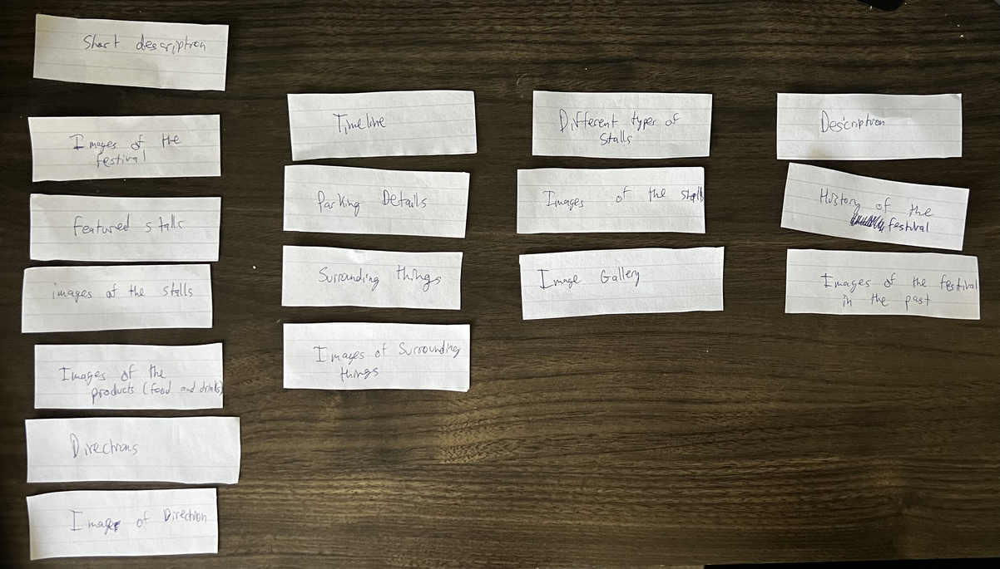

This iteration splits the planned content into 4 groups. One group contains the important content, like the when, where, what, and how details of the festival. This group contains the short description, images of the festival, featured stalls, directions, and images of the stalls, products, and directions. This would cover a lot of what many users from the target audience would want to know quickly, hence why I grouped them together as the first group. The next group combines the timeline, parking, and surrounding things. This is a group where the content is meant to be accessed more towards when you get to the festival as it lets users know what events are coming up on the timeline when they are present, where to park their cars, and what else they can check out once they are already in downtown Ithaca. The next group combines the stalls and the image gallery. Images are best to be included when describing stalls, and since there are many, it would go well with an image gallery that the users can use to get a good visualization of the festival in their heads. The last group is a mixture of the longer description and the history of the festival along with images of it in the past. This is a unique group that would be accessed by people genuinly interested in the festival and its background, so this shouldn't be put in the other groups as it can draw attention away from the rest.

### Final Content Organization (Milestone 1)
> Which iteration of card sorting will you use for your website?

I plan to use the first iteration of card sorting for my website.

> Explain how the final organization of content is appropriate for your site's audiences.

The final organization of content is appropriate for my site's audience as it makes each group/page as unique as possible. It makes the home page short and gives the audience a quick glimpse of what the festival is like. The home page should be short and shouldn't bore our audience. It should contain all important information of the festival like the time and place, along with a short description for those who are new to the Apple Harvest Festival. It should also contain a small collecton of stalls that would be good to display on the home page to give the audience an idea of what they are working with. There is a section for all the visitors information and is grouped up in one page, making it easy for the audience to access all the visitors info when they are planning their visit. There is also more specific content groups for those among the audience who wants to learn more if they weren't fully convinced by the home page or if they want to learn more about what to expect. There is a section for the stalls and their images, which could take a chunk of a user's time browsing through it. There is also a page for the history and a longer description for those who are interested in the actual details of the festival. This is not expected to be read by everyone so it is best to have it in its own page. The image gallery section should also be its own section as it is mainly just images. Since there are a lot of images, it is a lot of content so it should be its own page. It also wouldn't be accessed by every user among the audience as a good chunk of our audience would be satified with just the images we have next to the text content in the other pages. We do know that some groups in our target audience would like to see more images to learn more about what it looks like and what to expect. For example, this gallery section could be accessed by those who are attenting the festival for the first time or those who are Apple enthusiests and want to see the scale of the festival.

### Navigation (Milestone 1)
> Please list the pages you will include in your website's navigation.

- Home
- Visitors
- Stalls
- About
- Gallery

> Explain why the names of these pages make sense for your site's audience.

These are short and common among other festival/event sites. It is easy to understand the purpose of the different pages and seperates the content in an organized matter so that each page is unique and not repetative. It is also consistent as it is just 1 word, which is a plus since the names of pages should be short and easy to interpret right away for the audience.

## Visual Theme (Milestone 1)
> Discuss several (more than two) ideas about styling your site's theme. Explain why the theme ideas are appropriate for your target audiences. Note the theme you selected for your site and why it's appropriate for the audience and their goals.

One idea is having a color scheme of red, organge, and white as this is associated with apples and the fall. It would take on a friendly appearence/theme with its font family being more soft like Arial, Helvetica, sans-serif. It would also feature wider spacing and margins to make it easy to see and absorb the content. There would be a nav bar and a banner with the logo at the top. The banner should be an image that is a good representation of the festival and it should be big to be the first thing the users see. It is good to give the audience a good impresion of the festival at first glance of the site. The content would appear below a header of a the same color as that of the text. The text would be black. The background would be a light color like white. Images would be rounded cut.

Another idea is having a color scheme of red, and different shades of organge and yellow. This is associated with apples and the fall. The theme would be informative with the font being 'Franklin Gothic Medium', 'Arial Narrow', Arial, sans-serif, which is informative and seen on imformative pages like Cornell's Bowers CIS site that informs the audience about CIS. It would also feature consistent margins throughout to make it easy to see and absorb the content. There will be a big red section that has the logo centered on it. The content would appear below a header of the same color as the text. The text would be black. The will be many images to give the audience an idea of what it would look like, keeping the theme informative. The background would be one of the colors in the color theme of red, organge, and yellow shades. Images would be rectangle cut.

Another idea is having a color scheme of white and light red as this is associated with apples. It would take on a semi-professional appearence/theme with its font family being more soft like Cambria, Cochin, Georgia, Times, 'Times New Roman', serif. It would also feature tighter margins to make it have as much content that is visible by the audience. There would be a nav bar and a logo at the top. The logo would be bigger than many other components. The content would appear below a header of the same color than that of the text. The text would be black. The background would be a light color like white or light red. Images would be rectangle cut.

Final Theme: This theme has a color scheme of red, organge, and white as this is associated with apples and the fall. It would take on a friendly appearence/theme with its font family being more soft like Arial, Helvetica, sans-serif. It would also feature wider spacing and margins to make it easy to see and absorb the content. There would be a nav bar and a banner with the logo at the top. The banner should be an image that is a good representation of the festival and it should be big to be the first thing the users see. It is good to give the audience a good impresion of the festival at first glance of the site. The content would appear below a header of a different color than that of the text. The text would be black and the headers would be a dark red. The background would be a light color like white. Images would be rectangle cut since circular is too friendly and we still want aspects of our site to be informative and professional.

## Design (Milestone 1)

Document your site's layout.

### Layout Exploration (Milestone 1)
> Iterate on your site's design through sketching.
> Sketch both the narrow and wide versions of the site.
> Here you are just exploring your layout ideas. You don't need to sketch every page.
> Provide an explanation for each sketch explaining the idea and the design patterns you are leveraging.

Wide:

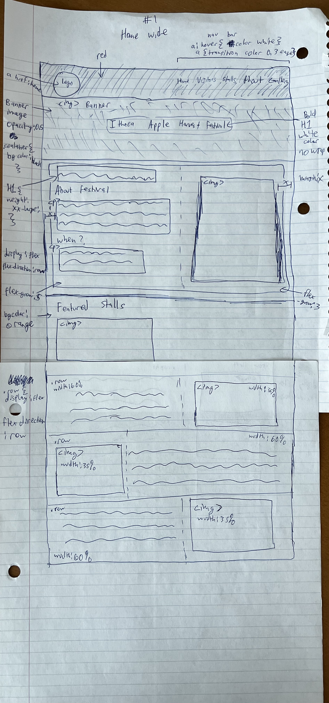

This has a header where the logo is on the top left and the nav bar is on the right. Below that is a banner that has a darkened image as the background and text on the center. The text at the center is one line and this is done but making it have nowrap. It is followed by a flex row where the about and when is on the left and the right is the image. Below that is a section that has a orange background is on the features stalls. It is 3 flex rows but the text and image alternate left and right sides.

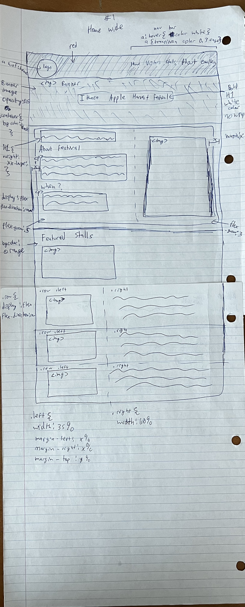

This is the same thing as Home Wide 1 but the images and text in the featured stalls section don't alternate. The images stay on the left and the description stays on the right. They are flex rows where the left is arond 35% and the right is about 60%.

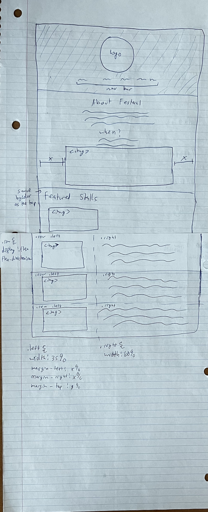

This one is a more centered approach where the logo is bigger and is at the cetner followed by the nav bar centered below it. The text is also centered and followed up with centered image. The featured stall section is the same as the one above.

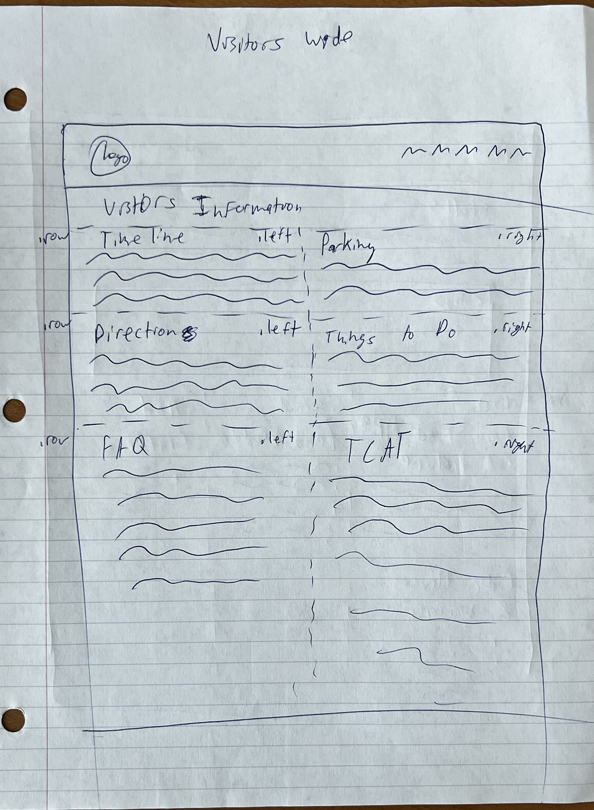

This has the header with the logo and the nav bar on the top, as explained in the home design. It has a header of Visitors information and is followed up with multiple flex rows. Each box coveres one of the topics discussed in the Visitors Page. There is headers for these topics followed up with paragraph text.

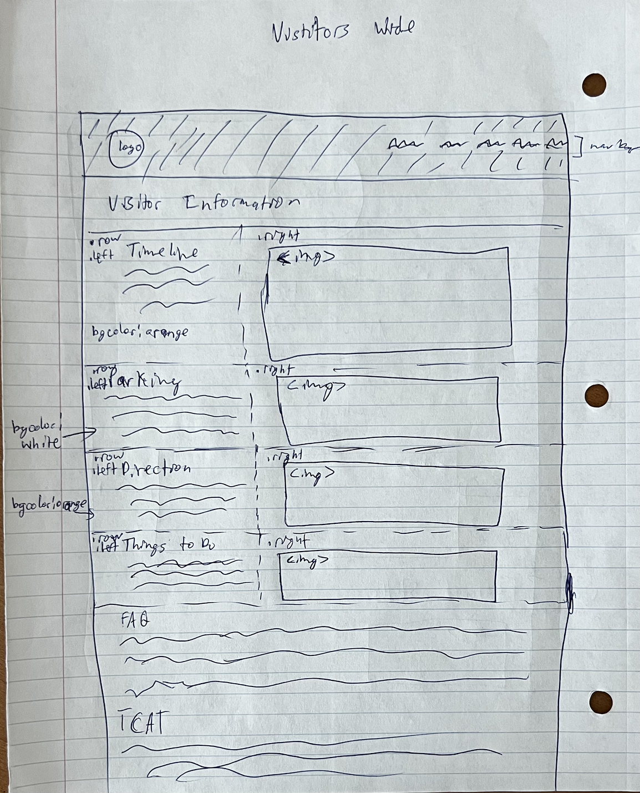

This has the header with the logo and the nav bar on the top, as explained in the home design. It has a header of Visitors information and is followed up with multiple flex rows. Each flex row covers one of the topics discussed in the visitors page. The left side is the description and details while the right side is the image associated to these. Not all sections need images, so those aren't flex rows and has the content cover the whole screen.

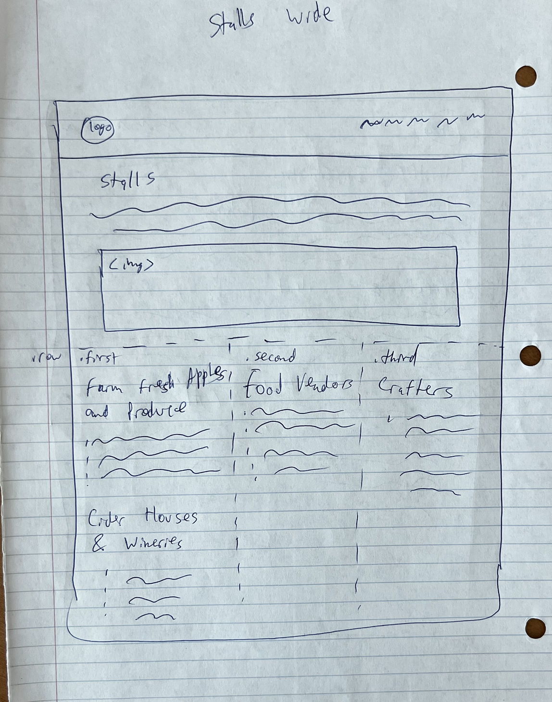

This has the header with the logo and the nav bar on the top, as explained in the home design. It has a Stall header followed with a short description. It has a flex row with 3 columns. One column has 2 categories because they are both really short. The other 2 columns have 1 category each. Each entry is in the list format.

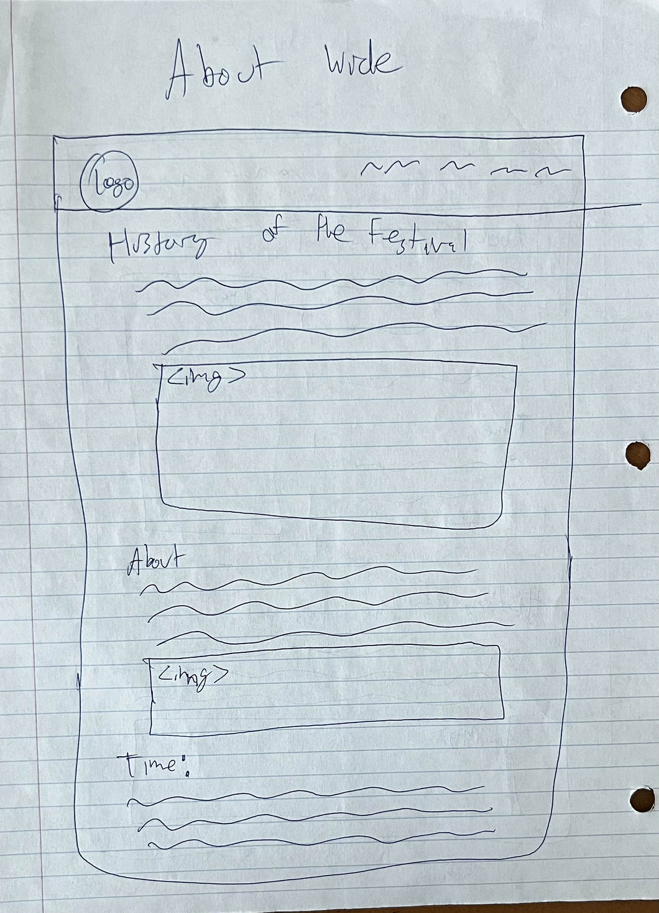

This has the header with the logo and the nav bar on the top, as explained in the home design. This approach takes a full display approach where each content takes up most of the display. The history section comes first, followed by its description and image. Same thing with the About section. It has the Time section at the bottom.

This has the header with the logo and the nav bar on the top, as explained in the home design. There is a flex row where the left box is the About and Time section with their details and the right section is an image. This row is followed by a History section with the header followed by its details and images.

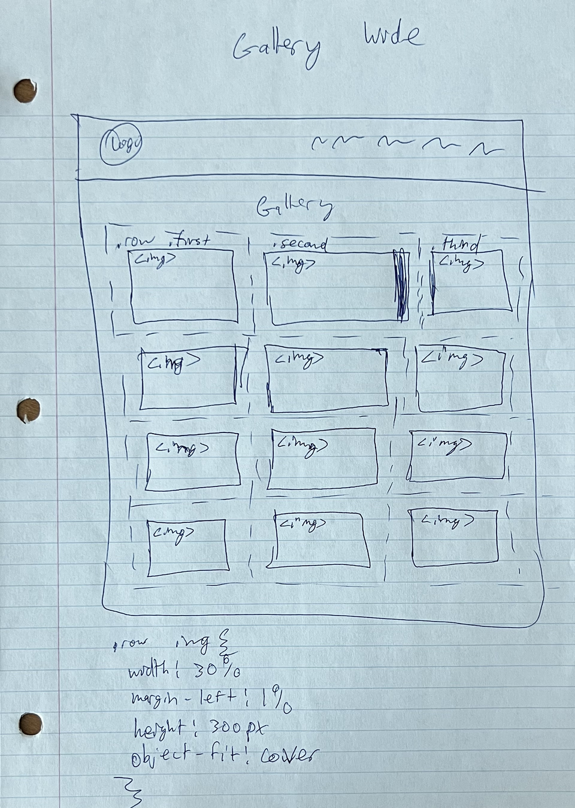

This has the header with the logo and the nav bar on the top, as explained in the home design. This has a flex row that has 3 columns that are 30% of the display each. Each column would have multiple photos in them but they stack vertically. Each image has the same dimentions as they are set to have the same width and height. This is dont by using the object-fit:cover line in the css that will basically crop the image to the set dimentions so it doesn't look distorted.

Narrow:

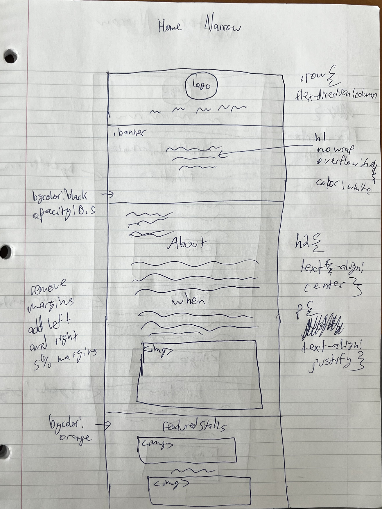

This has a header where the logo is on the top centered and the nav bar is below the logo centered but smaller size than the wide display. Below that is a banner that has a darkened image as the background and text on the center. The text in the center can and will have multiple lines, unlike the wide display. It then takes a full display stacking approach where everything takes up much of the screen horizontally and the content is in a vertical flow.

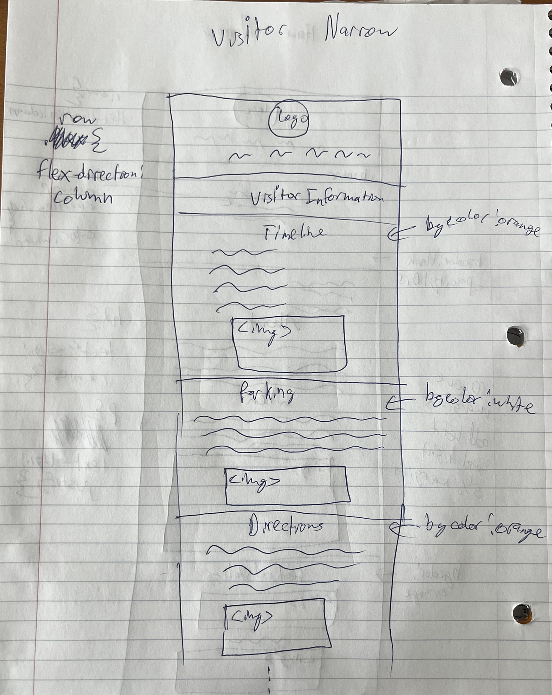

This has the same design and layout as the home narrow page but every section of content alternates background color. It alternates between white and orange.

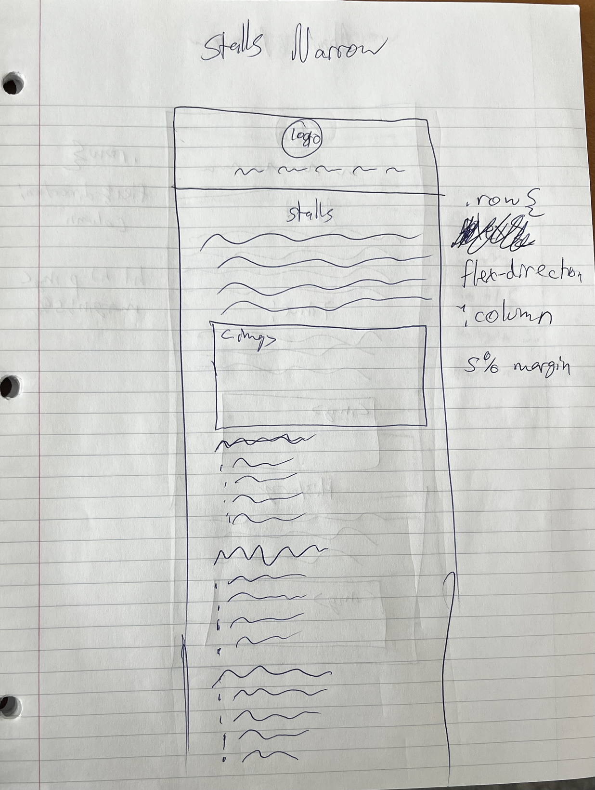

Same approach as the home page but everything is a white background. The list is left aligned though because it would look weird to have a centered list on a narrow display.

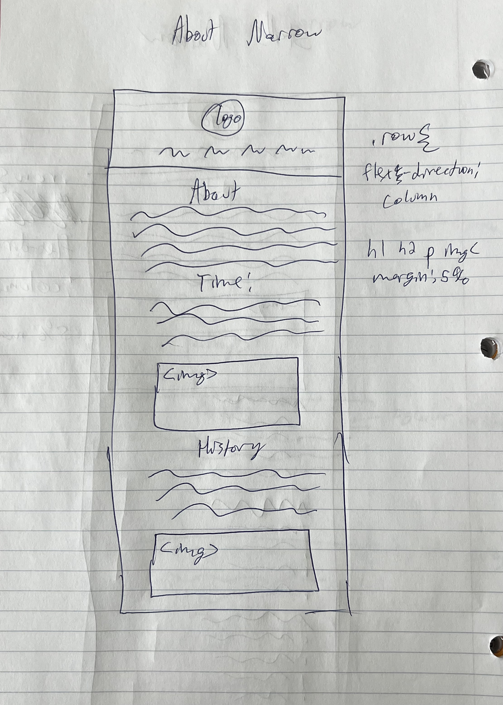

Same approach as every narrow page. It takes on a fill display approach where the content fills the the screen horizontally and the content flows vertically.

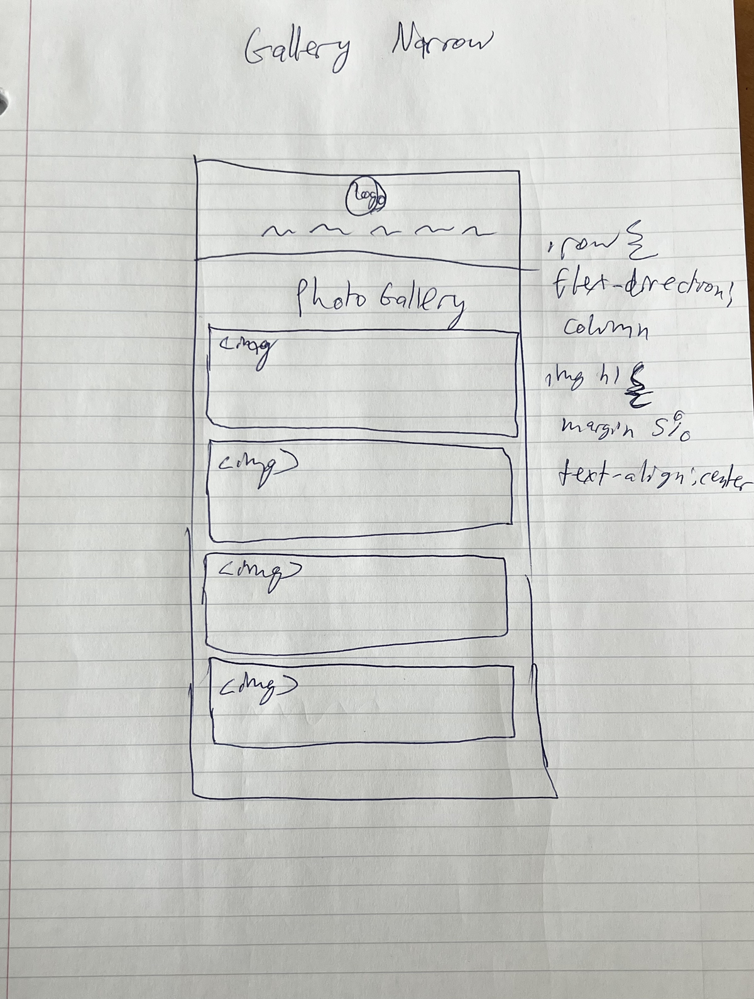

Same thing as About page. I did not include 3 columns because it would be too mushed up on a narrow page so its better to have it be one column.

### Final Design (Milestone 1)
> Include the final sketches for each of your pages.
> The sketches must include enough detail that another 1300 student could implement them.
> Provide an explanation for each sketch.

**Narrow (Mobile) Design:**

This has a header where the logo is on the top centered and the nav bar is below the logo centered but smaller size than the wide display. Below that is a banner that has a darkened image as the background and text on the center. The text in the center can and will have multiple lines, unlike the wide display. It then takes a full display stacking approach where everything takes up much of the screen horizontally and the content is in a vertical flow.

This has the same design and layout as the home narrow page but every section of content alternates background color. It alternates between white and orange.

Same approach as the home page but everything is a white background. The list is left aligned though because it would look weird to have a centered list on a narrow display.

Same approach as every narrow page. It takes on a fill display approach where the content fills the the screen horizontally and the content flows vertically.

Same thing as About page. I did not include 3 columns because it would be too mushed up on a narrow page so its better to have it be one column.

**Wide (Wide) Design:**

This has a header where the logo is on the top left and the nav bar is on the right. Below that is a banner that has a darkened image as the background and text on the center. The text at the center is one line and this is done but making it have nowrap. It is followed by a flex row where the about and when is on the left and the right is the image. Below that is a section that has a orange background is on the features stalls. It is 3 flex rows but the text and image alternate left and right sides.

This has the header with the logo and the nav bar on the top, as explained in the home design. It has a header of Visitors information and is followed up with multiple flex rows. Each flex row covers one of the topics discussed in the visitors page. The left side is the description and details while the right side is the image associated to these. Not all sections need images, so those aren't flex rows and has the content cover the whole screen.

This has the header with the logo and the nav bar on the top, as explained in the home design. It has a Stall header followed with a short description. It has a flex row with 3 columns. One column has 2 categories because they are both really short. The other 2 columns have 1 category each. Each entry is in the list format.

This has the header with the logo and the nav bar on the top, as explained in the home design. There is a flex row where the left box is the About and Time section with their details and the right section is an image. This row is followed by a History section with the header followed by its details and images.

This has the header with the logo and the nav bar on the top, as explained in the home design. This has a flex row that has 3 columns that are 30% of the display each. Each column would have multiple photos in them but they stack vertically. Each image has the same dimentions as they are set to have the same width and height. This is dont by using the object-fit:cover line in the css that will basically crop the image to the set dimentions so it doesn't look distorted.

### Design Rationale (Milestone 1)
> Explain why your design is appropriate for your audience.
> Specially, why does your content organization, navigation, and site design/layout meet the goals of your users?
> How did you employ **design patterns** to improve the familiarity of the site for your audience?

The wide header is appropriate because it the height is small but consistent. It is enough for the users to see and utelize but small enough so that they can focus on the other content on the page. The narrow header is appropriate because it makes it easier for users to click and use the nav bar since it is centered and has only itself in its row. The logo on the top emphasized the event name. The content organization for the rest of the pages is appropriate for my audience because is combines content and images to emphasize my points. They appear side to side on the wide display because it would be easier to take in everything and the images don't need to be that big on a wide display. The images would need to be small, so it is best to but them next to text using flex boxes. The differentiation in orange and white backgounds help users tell the when a new section of content appears and keeps the users engaged. The narrow display takes on a fill display approach that fills the screen horizontally and stacks the content vertically so it flows vertically. This is because the display is narrow, so images would be appropriate to have them take up most of the display. We cannot keep them next to text, as both the text and image would be too small to read and understand. Having them stack vertically is definety appropriate, expecially since people using the mobile display would most likely be at the festival and would need to access content quick, which could be done at the top nav bar. Everything is easier for them to see too. The nav bar is desinged to look like on like on other sites. The use of headers and sub hearers and margins also help destinguish what a title is, and what the details are. This allows for quick navigation through the page to get the designed section of details.

## User Testing (Final Submission)

### User Testing Tasks (Final Submission)
> Plan out your user testing tasks before doing your user testing.
> These must be actual user testing tasks.
> **Tasks are not questions!**

1. Tell me when the Apple Harvest Festival takes place

2. Tell me who performs on Sunday at 1:00 PM at the festival.

3. Let me know where I can park my car if I am commuting to the festival by car.

4. Let me know the name of a vendor who does crafting.

5. Give me a short description of the festival.

6. Tell me when the first festival occured.

7. Find me an image of people eating apples.

### Participant 1 (Final Submission)
> Using your notes from above, describe your user by answering the questions below.

1. Who is your user, e.g., where does the user come from, what is the user's job, characteristics, etc.?

    He is a freshman male who is a majoring in Computer Science at Cornell.

2. Does the user belong to your audience of the site?

    > If “No”, what’s your strategy of associating the user test results to your audience’s needs and wants? How can your re-design choices based on the user tests make a better fit for the audience?

    Yes

### Participant 1 -- Testing Notes (Final Submission)
> When conducting user testing, you should take notes during the test.

Task 1: He was already on the home page, so he just scrolled a little and found the dates that the festival occurs on in the "When?" section.

Task 2: He continued scrolling on the home page, but didn't find anything and reached the end so he went back to the top to the nav bar. He selected the visitors tab and found the entertainment section and told me the right answer as it was located there.

Task 3: He pointed out the Parking symbol he saw on the image right next to the Timeline section he was just on from the previous task. He told me that I could park there. He also let me know that there were more places since he scrolled a little and found the "Parking" section right below.

Task 4: He went back to the top of the page to access the nav bar. He clicked on the Stalls tab. He scrolled a little bit and found a section titled Crafters. He named me one of the vendors in that list.

Task 5: He went back to the top of the page and clicked on the About tab on the nav bar. He read to me the description that was on the first section at the top. This section was titled "About the Festival".

Task 6: Since he was already on the about tab, he scrolled some more and found the history section. He read it and found the answer in the first line. He told me the year it was first started.

Task 7: He went back to the top of the page and clicked on the Gallery tab. He scrolled through the images until he found an image of people eating apples. He showed me this image.

### Participant 2 (Final Submission)
> Using your notes from above, describe your user by answering the questions below.

1. Who is your user, e.g., where does the user come from, what is the user's job, characteristics, etc.?

    He is a male uber driver who drives customers in Ithaca.

2. Does the user belong to your audience of the site?

    > If “No”, what’s your strategy of associating the user test results to your audience’s needs and wants? How can your re-design choices based on the user tests make a better fit for the audience?

    Yes

### Participant 2 -- Testing Notes (Final Submission)
> When conducting user testing, you should take notes during the test.

Task 1: He clicked on the About tab and read until he found a section titled "Time:". He let me know the time and dates of the festival.

Task 2: He continued scrolling on the About page, but didn't find anything and reached the end so he went back to the nav bar. He selected the Visitors tab and found the entertainment section and told me the who performs at the time at that date.

Task 3: He scrolled down on the visitors page found the "Parking" section right below. He read it some bit and told me the locations I could park for free and for a fee.

Task 4: He went back to the top of the page to the nav bar. He clicked on the Stalls tab and scrolled until he found a section titled "Crafters". He named me one of the vendors in that list.

Task 5: He went back to the top of the page and clicked on the Home tab on the nav bar. He read to me the description that was on located on the section titled "About".

Task 6: He went back to the top to get to the nav bar. He clicked on the About tab. He scrolled some bit until he reached a section titled "History of the Festival".

Task 7: He went back to the top of the page and clicked on the Gallery tab. He scrolled through until he found an image of people eating apples. He pointed out this one.

### Participant 3 (Final Submission)
> Using your notes from above, describe your user by answering the questions below.

1. Who is your user, e.g., where does the user come from, what is the user's job, characteristics, etc.?

    She is a junior in the Hotel Administration School at Cornell.

2. Does the user belong to your audience of the site?

    > If “No”, what’s your strategy of associating the user test results to your audience’s needs and wants? How can your re-design choices based on the user tests make a better fit for the audience?

    Yes

### Participant 3 -- Testing Notes (Final Submission)
> When conducting user testing, you should take notes during the test.

Task 1: She was scrolled a little on the home page and the "When?" section found the dates.

Task 2: She went to the nav bar at the top. She selected the visitors tab. She found the entertainment section and told me who performs at that time and date.

Task 3: She scrolled more on the visitors tab and found the "Parking". She read it and told me the places I could park my car.

Task 4: She went to the top of the page to the nav bar. She clicked on the Stalls tab and scrolled a little bit and found a section called Crafters. She told me one of the vendors in that list.

Task 5: She went to the top of the page. She clicked on the About tab on the nav bar. She found a section titled "About the Festival" at the middle of the page. She read to me the short description that was here.

Task 6: She scrolled on the history tab until she found the history section. She read it. She told me the year correctly.

Task 7: She went to the top of the page and clicked on the Gallery tab. She scrolled through the images until she found an image of people eating apples. She pointed this one out.

### Potential Changes Based on User Testing (Final Submission)
> What changes would you make to your design based on user testing?
> Note: You are not required to change your design. Simply tell  us what you would change.

I might want to change the name of Stalls to Venders but this is beneficial depending on the person. Some people prefer one over the other so it is fine as it is right now.

## Rationale (Final Submission)

**This rationale should be polished writing:** one you might submit as a report to a client or boss to help explain the project and convince them you did a good job. You'll be surprised how much writing and communicating you need to do about projects and choices on internships and jobs; practice that here.

It should be a comprehensive, complete story of the project. You might find that each section runs about a paragraph. Sketches can often help tell the story of your design.

Your rationale should be a polished version of the earlier explanations.

### Audience (Final Submission)
> A complete and polished description of the intended audience(s) for your website.

The site's audience is a combination of students, Ithaca locals, and enthusiasts of apple-related things. All members of this group would visit the site to learn more about the Ithaca Apple Harvest Fesitval. The target audience is mainly in Ithaca but could include people from other places that are interested in apple-related things. Ithaca holds 2 colleges so there is a big student population in our target audience. This festival might also attract apple and cider enthusiasts who don't know much about Ithaca and the festival along with its features.

### Audience Goals
> Explain how your site's design addresses the goals of the audience.

The site's design addresses the goals of the audience as it considers students, locals, and people outside of Ithaca. It has content, like the Parking and Directions, that serves addressed the audience and their goals. Everything that a target audeience member would want to know is included on the site. The site ranges in content from time and place to directions, parking, venders, history, and photos.

### Visual Design (Final Submission)
> An explanation of how the final design is appropriate for your audience.
> Include design patterns in your rationale.

The final design is appropriate for my audience because it is very easy to navigate and has common design patterns. For example, the nav bar and logo is set up in a way that is commonly seen on other event websites. The use of headers, subheaders, and different sizes and weights helps with organizing content and determining the type of content a section has. It is easy for a user to navigate and find what they want thanks to this. The use of margins and set heights and widths also help make the site look clean and nothing sticks out.

### Self-Reflection (Final Submission)
> Take some time here to reflect on how much you've learned since you started this class. It's often easy to ignore our own progress. Take a moment and think about your accomplishments in this class. Hopefully you'll recognize that you've accomplished a lot and that you should be very proud of those accomplishments!

I've learned a lot about HTML and CSS and how the many elements in both apply to the physical product, which is a site. I learned how to make a site that is publish-worth based on design and organization. I've learned about Media Qeuries, which is a thing I didn't know about before. I've learned how to accomadate for multiple display sizes.

## Grading (Final Submission)

### Collaborators
> List any persons you collaborated with on this project.

I am the solo collaborater.

### Reference Resources
> Please cite any external resources you referenced in the creation of your project.
> (i.e. W3Schools, StackOverflow, Mozilla, etc.)

W3Schools and Mozilla
